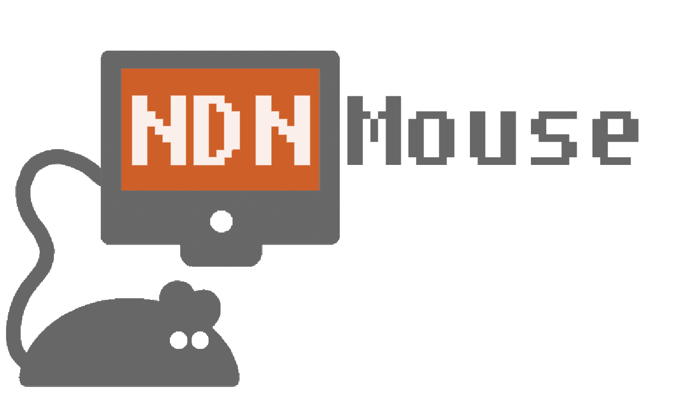

# Documentation

### Overview

It's a secure control interface for a PC over named-data-networking (NDN), using a mobile device! It also has UDP support.

### Current Features

* Mouse control: movement, left click, right click, tap-to-click
* Mouse sensitivity settings
* UDP and NDN support
* UDP Security: data encryption only
* NDN Security: data encryption (signature validation coming soon)

### Planned Features

* NDN Security: packet signature validation
* Rudimentary keyboard support (for slideshow control?)

### Supported Platforms

##### Severs/Producers (phone): 
* Any relatively modern Android phone

##### Clients/Consumers (PC): basically anything that can run [NFD](http://named-data.net/doc/NFD/current/INSTALL.html) and Python3
* Any Linux distribution that can run NFD and Python3 (tested on Ubuntu 16)
* OSX
* Windows (no NFD, so UDP support only)

# How to Use

### Dependencies
* [Python3](https://www.python.org/downloads/) (PC)
* [PyAutoGUI](https://pyautogui.readthedocs.io/en/latest/install.html) (PC)
* [pycrypto](https://pypi.python.org/pypi/pycrypto) (PC)
* [NFD](http://named-data.net/doc/NFD/current/) (PC and Android)

### Install

1. Install NFD on your [Android phone](https://play.google.com/store/apps/details?id=net.named_data.nfd) and the [PC](http://named-data.net/doc/NFD/current/INSTALL.html) on which you want to control the mouse.
1. Compile and install the app using Android Studio on your Android phone.
1. On your PC, install Python3, PyAutoGUI, and pycrypto
	1. Python3: `sudo apt-get install python3`
	1. pip3 (to help install Python libraries): `sudo apt-get install python3-pip`
	1. PyAutoGUI: `sudo pip3 install pyautogui`
	1. pycrypto: `sudo pip3 install pycrypto`

### Running

1. Make sure NFD is started on both your phone (the server/producer) and your PC (the client/consumer). Use the NFD app to start it on Android. On PC, use `nfd-start`.
1. On your phone, start the server within ndnMouse (you can choose NDN or UDP protocol).
1. On your PC, execute the matching-protocol Python script in the [pc_client](./pc_client) directory.
1. Control :mouse::exclamation:

# Screenshots

&nbsp;&nbsp;&nbsp;&nbsp;&nbsp;&nbsp;&nbsp;&nbsp;&nbsp;&nbsp;
&nbsp;&nbsp;&nbsp;&nbsp;

# License
See [here](./LICENSE)